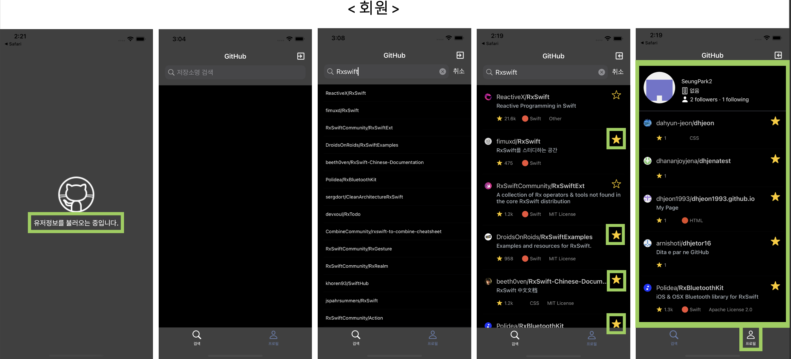

# GithubSearchClone
Github 앱 만들기

# 실행방법
1. git pull (또는 Download)
2. pod install
3. client id, client secret 값 입력  
    3-1. Model -> UserInfo -> reqeustAPIToken -> parameter  
    3-2. Model -> UserInfo -> requestGithubCode -> url 
4. 실행

## 요구사항
> [Github API](https://docs.github.com/en/rest)를 이용해 로그인, 검색, 프로필을 구현하시오.

## 사용 스킬 & 라이브러리
* Swiftm, Storyboard
* RxSwift, RxCocoa, Kingfisher
* MVVM

## 참고사항
* 모든 파일 내부 구성은 아래와 같은 순서로 작성되었습니다.
  * Public Properties
  * Public Method
  * Life Cycle (in viewController)
  * Private Method
  * Private Properties
  * IBOutlet (in viewController)

## SCREEN

* * *
</img> </img> 

